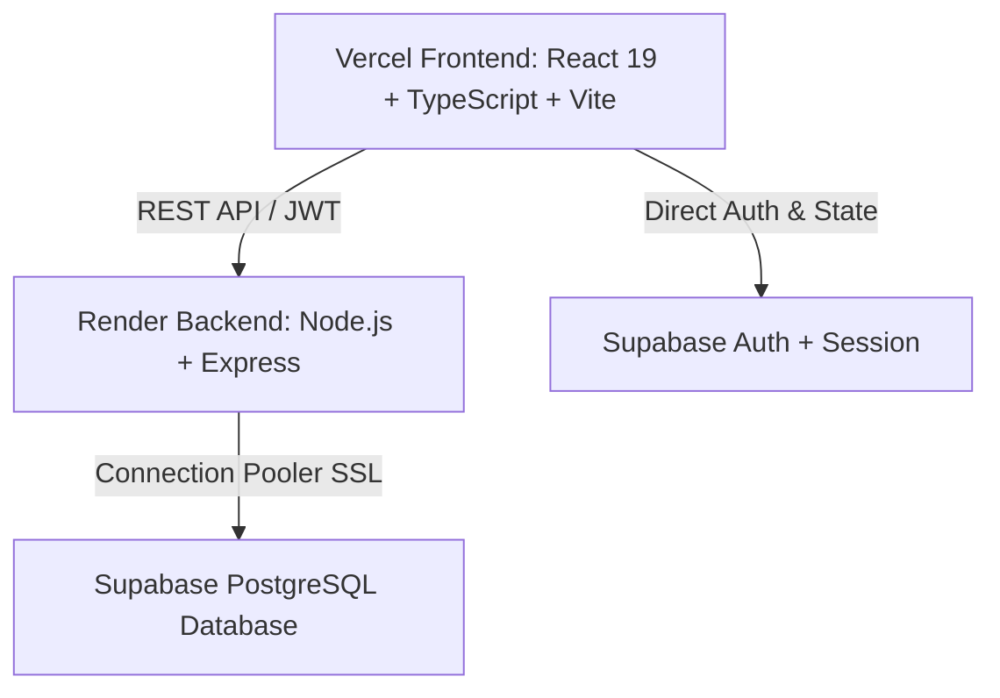

# 🔥 Ashen Path: Chronicles of Ash — Life RPG

> **Turn Real-World Habits into Legendary RPG Conquests.**  
> A full-stack, gamified productivity engine built to conquer procrastination, track daily habits, level up character attributes, unlock live pixel gear, and slay Abyss World Bosses with real-life completed work.

---

## 🌟 Key Features

### 📜 1. Notice Board Quests & Daily Rituals
- **Multi-Category Tagging**: Organize quests by `Work`, `Gym`, `Study`, `Chores`, and `Others`.
- **Daily Reminders**: Toggle daily recurring routines to build long-lasting discipline.
- **Difficulty & XP Scaling**: Tiered difficulty (1–5) rewarding XP, coins, and attribute points.
- **Flame Streaks**: Track consecutive days of completed tasks with streak flame bonuses.

### ⚔️ 2. Six Core RPG Attributes
Your character grows across 6 distinct attributes based on the real habits you complete:
- 🏋️ **Strength**: Physical workouts, sports, and endurance training.
- 🧠 **Intellect**: Coding, reading, problem-solving, and deep work.
- 🎯 **Discipline**: Daily habits, consistency, and routine maintenance.
- ⚡ **Agility**: Fast sprints, quick errands, and task turnaround.
- 🛡️ **Vitality**: Health, hydration, recovery, and sleep.
- 💬 **Charisma**: Networking, speaking, leadership, and collaboration.

### 👹 3. Abyss World Bosses (Work-to-Earn Raids)
- **Zero Pay-to-Win**: Attack slashes **cannot** be bought; they are earned solely through real-world effort (**1 Slash per 50 XP**).
- **Multi-Tier World Bosses**: Slay the *Corrupted Behemoth*, *Void Serpent*, *Infernal Dragon*, and *Abyssal Titan*.
- **Boss Defeat Rewards**: Massive coin bounties, prestige titles, and exclusive equipment.

### 🛡️ 4. Bazaar & Live Pixel Armory
- **Equip Real Pixel Gear**: Purchased items dynamically attach to your interactive pixel hero sprite in real-time (Swords, Shields, Viking Helmets, Ghost Wisps, Royal Plate, and the Crown of Sovereignty).
- **Balanced Economy**: Tiered item costs designed for **1-week**, **1-month**, and **1-year** milestones.

### 📖 5. Ancient Codex of Discipline
- Interactive ancient tome containing sacred rules, strategies, and lore to maximize focus and habit retention.

### 🔐 6. Production-Ready Authentication & Security
- **Supabase Auth**: Instant sign-ups with email/password and secure session management.
- **Password Recovery Flow**: Safe password reset interceptor requiring new password confirmation and seamless re-authentication.
- **Guest / Preview Mode**: Explore the full guild realm before signing in.

---

## 🏗️ Architecture & Tech Stack



### **Frontend**
- **Framework**: React 19 + TypeScript + Vite 8
- **Styling**: TailwindCSS 4 + Vanilla CSS Custom Design System (Cinzel, Outfit, JetBrains Mono)
- **State Management**: Zustand
- **Animations**: Framer Motion + Canvas Confetti
- **Asset Optimization**: SVG Pixel Hero Sprite Engine, modular vendor chunking

### **Backend**
- **Runtime**: Node.js (v18+) + Express + TypeScript
- **Database Engine**: PostgreSQL via `pg` Connection Pooler with auto-SSL
- **Security**: Helmet, CORS multi-origin whitelisting, Zod payload validation
- **Reliability**: Zero-Crash error handlers, graceful shutdown lifecycle hooks

### **Database & Infrastructure**
- **Database & Auth**: Supabase (PostgreSQL 3NF schema, Row-Level Security)
- **Hosting**: Vercel (Frontend SPA) + Render (API Web Service)

---

## 🚀 Quickstart & Local Setup

### 1. Clone the Repository
```bash
git clone https://github.com/ayush-code07/Life-RPG.git
cd Life-RPG
```

### 2. Backend Setup
```bash
cd backend
npm install
```
Create a `.env` file inside `backend/`:
```env
PORT=5000
NODE_ENV=development
DATABASE_URL=your_supabase_postgres_connection_string
DATABASE_SSL=true
SUPABASE_URL=https://your-project.supabase.co
SUPABASE_SECRET_KEY=your_supabase_service_role_key
SUPABASE_JWT_SECRET=your_supabase_jwt_secret
CORS_ORIGIN=http://localhost:5173
```
Start the backend server:
```bash
npm run dev
```

### 3. Frontend Setup
```bash
cd ../frontend
npm install
```
Create a `.env` file inside `frontend/`:
```env
VITE_SUPABASE_URL=https://your-project.supabase.co
VITE_SUPABASE_ANON_KEY=your_supabase_anon_key
VITE_API_URL=http://localhost:5000
```
Start the frontend dev server:
```bash
npm run dev
```
Open **[http://localhost:5173](http://localhost:5173)** in your browser.

---

## 📦 Deployment Guide

Refer to [`DEPLOYMENT.md`](./DEPLOYMENT.md) for complete step-by-step instructions on deploying:
- **Database**: Supabase SQL Migration
- **Backend API**: Render Web Service
- **Frontend**: Vercel SPA

---

## 🛡️ License & Author

Crafted with dedication by **Ayush Jagnani**.  
*Made with coffee and love ☕❤️*

Released under the **MIT License**.
